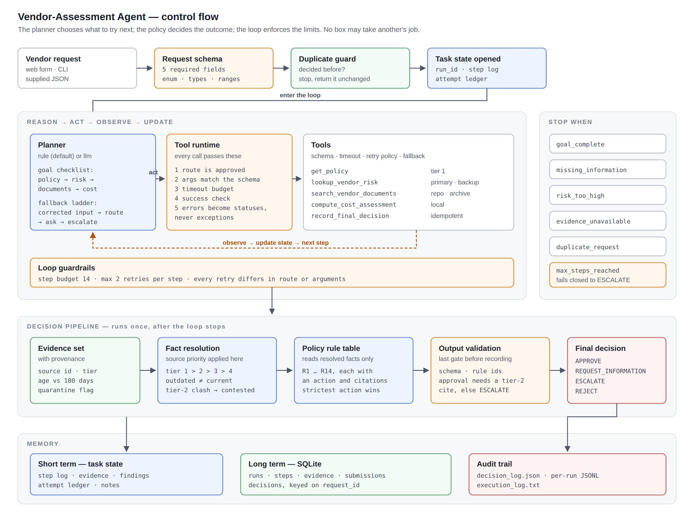
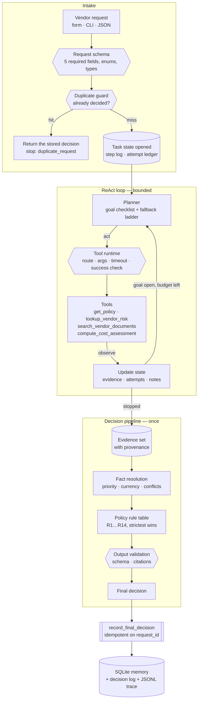

# Architecture

The same diagram is available as [architecture.svg](architecture.svg).

## The one rule the design follows

Three responsibilities are kept apart, and nothing is allowed to blur them:

| Component | Decides | Never decides |
| --------- | ------- | ------------- |
| Planner (`planner/rule.py`, `planner/llm.py`) | which tool to call next, and how to recover from a failure | the outcome |
| Policy engine (`policy.py`, `facts.py`) | the outcome, from resolved facts | when to stop calling tools |
| Loop (`agent.py`) | when to stop, what a legal retry is, what gets recorded | what the answer is |

That separation is why an LLM can be dropped into the planner slot without
becoming able to approve a purchase, and why a hostile document cannot change
an outcome even if it manages to change the plan.

## Flow

## Stopping rules

The loop stops for exactly one of six reasons, and every decision carries the
one that applied:

| Stop reason | Raised when |
| ----------- | ----------- |
| `goal_complete` | every evidence goal is settled and the policy can be applied in full |
| `missing_information` | a required field is absent, so no tool could supply the answer |
| `risk_too_high` | a rejection is established and nothing stricter exists |
| `evidence_unavailable` | required current evidence could not be retrieved |
| `duplicate_request` | a final action for this request ID already exists |
| `max_steps_reached` | the step budget ran out — the request escalates rather than being decided on partial evidence |

## Why the pipeline is separate from the loop

The policy is evaluated once, on the whole evidence set, after the loop stops.
Two things follow that would not hold if rules were applied as evidence arrived:

- **Conflicts are visible.** A rule cannot notice that two sources disagree
  until both have been retrieved. Evaluating incrementally would let whichever
  source answered first decide the outcome.
- **The strictest action wins.** `R4-COST-ABOVE-THRESHOLD` fires for a cost over
  the limit, but if the same vendor is prohibited, the answer must be `REJECT`.
  Deciding early would return the escalation and never look.

The planner still stops early where it is safe to: a missing required field, or
a rejection that nothing can outrank.
